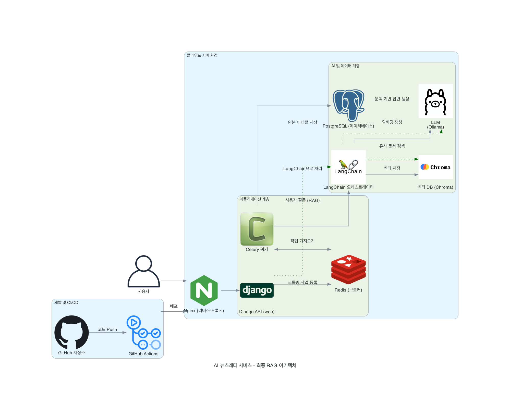

# AI Insight Extractor

AI를 활용하여 웹 콘텐츠를 분석하고, RAG(Retrieval-Augmented Generation) 기술을 통해 깊이 있는 인사이트를 도출한 후, 결과를 요약하여 이메일 초안을 생성하는 프로젝트입니다.

## 🌟 주요 기능

-   URL 또는 텍스트 입력을 통한 콘텐츠 분석
-   LangChain 및 LLM(GPT, Gemini 등)을 활용한 내용 요약 및 인사이트 생성
-   VectorDB를 사용한 RAG 파이프라인 구축
-   분석 결과를 기반으로 한 이메일 초안 자동 작성
-   Celery를 이용한 비동기 처리

## 🛠️ 기술 스택

-   **Backend:** Python, Django, Django Rest Framework
-   **AI/LLM:** LangChain, OpenAI API, ChromaDB
-   **Async Task:** Celery, Redis
-   **Database:** PostgreSQL
-   **Infrastructure:** Docker, Nginx
-   **CI/CD:** GitHub Actions

## 🏗️ 시스템 아키텍처




## 🛢️ ERD
```mermaid
erDiagram
    USER  {
        int id PK
        string password
        string username
        string email UK
        bool is_staff
        bool is_active
        bool is_superuser
    }

    NEWSLETTER  {
        int id PK
        int user_id FK
        string title
        text content
        datetime created_at
        datetime sent_at
    }

    USER_KEYWORD  {
        int id PK
        int user_id FK
        int keyword_id FK
    }

    KEYWORD  {
        int id PK
        string name UK
    }

    ARTICLE  {
        int id PK
        int keyword_id FK
        string title
        string url UK
        text content
        datetime published_at
    }

    USER  ||--o{ NEWSLETTER  : "receives"
    USER  ||--o{ USER_KEYWORD  : "has"
    KEYWORD  ||--o{ USER_KEYWORD  : "is"
    KEYWORD  ||--o{ ARTICLE  : "related to"